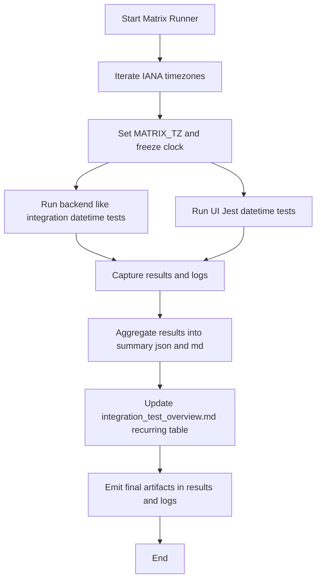

# Date/Time Handling & Timezones Integration Test Plan

Project: Calendar-Todo Application  
Version: 1.0.0  
Last Updated (UTC): 2025-09-07T12:05:42Z

1. Objective and Scope

- Objective
  - Validate correctness, consistency, and robustness of date/time features across timezones, DST transitions, locale formatting, and temporal range boundaries, with emphasis on recurring event processing and exception handling.
- Scope
  - System APIs and services
  - Schedulers and queues
  - Database persistence and caches
  - UI presentation layers
  - Cross-service synchronization touching date/time fields
  - Read and write paths, event generation logic, conflict resolution, idempotency, serialization integrity

2. Primary References and Current Assets

- Overview and status tracker: [integration_test_overview.md](../../tests/integration/integration_test_overview.md)
- Existing integration harness setup: [integrationTestSetup.ts](../../tests/integration/integrationTestSetup.ts)
- Date/Time integration suite (existing):
  - [datetime_test_setup.ts](../../tests/integration/datetime/datetime_test_setup.ts)
  - [datetime_test_executor.ts](../../tests/integration/datetime/datetime_test_executor.ts)
  - [timezone_conversion.test.ts](../../tests/integration/datetime/timezone_conversion.test.ts)
  - [dst_handling.test.ts](../../tests/integration/datetime/dst_handling.test.ts)
  - [date_formatting.test.ts](../../tests/integration/datetime/date_formatting.test.ts)
  - [time_range_validation.test.ts](../../tests/integration/datetime/time_range_validation.test.ts)
- Basic UI-level datetime tests: [timezone_basic.test.ts](../../ui/src/tests/integration/datetime/timezone_basic.test.ts)
- Test runner frameworks
  - Root invokes UI Jest: [package.json](../../package.json)
  - UI Jest configuration and runner: [jest.config.js](../../ui/jest.config.js), [package.json](../../ui/package.json)

3. Designated Folder Structure for This Effort

- Tests: tests/integration/date_time
- Recurrence-specific tests: tests/integration/date_time/recurrence
- Documentation: docs/integration/date_time
- Results artifacts: results/integration/date_time
- Execution logs: logs/integration/date_time
- Runner and utilities: scripts/integration/date_time

Note: New artifacts will be placed into the designated structure. Existing content under tests/integration/datetime is reused and mirrored by the matrix runner; no duplication of source unless adaptation is required.

4. Timezone and DST Test Matrix

- IANA timezones
  - UTC
  - America/New_York
  - Europe/Berlin
  - Asia/Kolkata
  - Australia/Sydney
  - Pacific/Apia
  - Pacific/Chatham
  - Asia/Tehran
  - America/Santiago
- Matrix execution rules
  - All categories run across the full matrix unless a test is explicitly gated
  - Explicit timezone passed via environment variable MATRIX_TZ to tests
  - All parsing and formatting operations must use Intl APIs with timeZone equal to MATRIX_TZ or explicitly set library options; do not rely on host defaults

5. Deterministic Time Control Strategy

- Use a fixed or frozen clock for all tests
  - For Jest-based suites, prefer modern fake timers where appropriate and override now sources deterministically
  - For code paths that depend on current time within mocks, centralize Date.now() reads behind a small utility that we can freeze/advance/reset in tests
- Queues and schedulers
  - When simulating schedulers, advance clock deterministically and capture execution timestamps
- Never rely on wall clock or host defaults

6. Data Storage and Serialization Validation

- Storage
  - Persist timestamps in UTC with appropriate precision
  - Validate database ordering and indices on timestamp columns by simulated reads and sorted result assertions
- Serialization
  - Use RFC 3339 and ISO-8601 with timezone offsets when required
  - Validate round-trip parse stability and precision retention across services and caches
- Cross-service
  - Validate payloads and message envelopes carry explicit timezone annotations where required

7. Performance and Reliability Metrics

- Capture per-category durations and total wall time
- Recurrence expansion performance for large windows; record counts and duration
- Flakiness detection
  - Repeat option to detect inconsistent results; quarantine flakies and document stabilization recommendations
- Results rollup must include average execution time, slowest scenarios, and flakiness stats

8. Categories and Acceptance Criteria

- Timezone Conversion Testing (DTTZ-TZC-*)
  - UTC conversions, cross-timezone synchronization, offset correctness, ambiguous and nonexistent local times, rare offsets
  - Round-trip conversions and DB read/write fidelity
  - Server default vs per-user timezone vs overrides
  - Date, week, and month boundary transitions when crossing timezones
- DST Handling Validation (DTTZ-DST-*)
  - Spring-forward and fall-back across regions, handling gaps and overlaps
  - Event scheduling windows, deduplication on overlaps, invalid local times in gaps
  - Cron-like schedules must not double-run or skip erroneously
  - Logs and metrics continuity across transitions
- Date Formatting Verification (DTTZ-FMT-*)
  - Locale-specific formats, numeral systems, cultural calendars when implemented
  - Consistent short, medium, long, full patterns
  - User input parsing and safe fallbacks on missing locale data
  - Zero-padding, 12h or 24h correctness, stable sort order for export strings
- Time Range Validation Assessment (DTTZ-TRV-*)
  - Leap years, leap seconds if applicable, month ends, century boundaries, min and max representable dates, invalid date detection
  - Inclusive or exclusive endpoints as per business rules
  - Pagination and windowed queries by timestamp ordering
  - NTP drift and clock skew assumptions tested with monotonic or fixed clock
- Recurring Event Processing (DTTZ-RRULE-*)
  - RFC 5545-style RRULE semantics or canonical engine
  - Generation and evaluation under multiple timezones and DST, skipped or duplicated local times
  - EXDATE, RDATE, or system-specific skip lists
  - Idempotent regeneration and conflict resolution on rule or timezone change
  - For each scenario assert count-in-window, ordering, UTC timestamps, local renderings, and stable regeneration

9. Recurring Scenarios and Acceptance Criteria Details

- Daily across month boundaries and DST; correct count and timestamps in UTC and local
- Weekly with multiple weekdays; correct week rollovers across timezones
- Monthly
  - Day-of-month, day-of-week, last-day, nth weekday rules
  - Behavior for months lacking a given day
- Custom patterns
  - Every N hours, mixed rules, bounded recurrences with COUNT or UNTIL
- Exceptions
  - EXDATE and RDATE behavior, one-off skips, moved occurrences, series edits without corruption or orphans

10. Execution Architecture and Scripts

- Runner scripts to be added
  - Full matrix: [run_full_matrix.js](../../../scripts/integration/date_time/run_full_matrix.js)
    - Iterates IANA timezones, runs both backend-like integration tests and UI Jest-side tests per timezone
    - Sets MATRIX_TZ and writes logs to logs/integration/date_time
    - Aggregates JSON and MD summaries into results/integration/date_time
  - Per-category: [run_category.js](../../../scripts/integration/date_time/run_category.js)
    - Runs a single category across the matrix
  - Overview updater: [update_overview_recurring.js](../../../scripts/integration/date_time/update_overview_recurring.js)
    - Post-execution mutation of [integration_test_overview.md](../../tests/integration/integration_test_overview.md) Recurring Event Processing table with Status, Last Run ISO-8601 UTC, Result, and Notes
- Execution modes
  - UI layer
    - Invoke Jest in [ui/package.json](../../ui/package.json) with testPathPattern filters for datetime integration and recurrence tests
  - Backend-like integration
    - Reuse existing tests under tests/integration/datetime via a root-level Jest config or direct orchestration using [datetime_test_executor.ts](../../tests/integration/datetime/datetime_test_executor.ts)
- Environment capture
  - Record Node version, process.versions.icu, Intl.supportedValuesOf('timeZone').length, default Intl.DateTimeFormat().resolvedOptions().timeZone
  - Record OS info and commit SHA if available

11. Artifact Naming Conventions

- Use ISO-8601 timestamps in UTC
- Prefix: date_time_
- Include category and short descriptor
- Suffix: YYYYMMDDTHHMMSSZ
- Examples
  - date_time_dst_spring_forward_results_20250907T120000Z.json
  - date_time_recurrence_weekly_logs_20250907T120000Z.txt

12. Results and Logging

- Results
  - JSON rollup: [results_summary.json](../../../results/integration/date_time/results_summary.json)
  - Human-readable: [results_summary.md](../../../results/integration/date_time/results_summary.md)
- Logs
  - One file per run per category in logs/integration/date_time
  - Include execution IDs, environment capture, per-test durations, and error payloads or SQL snapshots when applicable

13. Phase 1: Historical Analysis and Adaptation

- Inputs
  - Existing unit, integration, and e2e artifacts, especially those under tests/integration/datetime and ui/src/tests/integration/datetime
- Activities
  - Identify reusable components: fixed clock, timezone-aware parsers, RRULE processors or simulators, date formatters, and validators
  - Map legacy test cases to new DTTZ IDs and document in [traceability_map.md](traceability_map.md)
  - Re-run adapted tests under the full timezone matrix
- Outputs
  - [adaptation_report.md](adaptation_report.md): Summary of adaptations, deltas, and reuse decisions
  - Matrix execution logs in logs/integration/date_time
  - Results per run in results/integration/date_time

14. Phase 2: Comprehensive Suite Development and Execution

- Implement and execute deterministic, idempotent tests for all five categories
- Validate both API responses and persisted representations (UTC normalization)
- Cover DST transitions using current year and nearest historical transitions for regions in scope
- Ensure serialization uses RFC 3339 or ISO-8601 with timezone annotations where required

15. Phase 3: Documentation and Integration

- Update [integration_test_overview.md](../../tests/integration/integration_test_overview.md) with
  - Categories covered
  - Timezone matrix used
  - DST scenarios validated
  - Recurrence scenarios and outcomes
  - Environment details including ICU and Intl info
  - Coverage metrics and pass or fail status per category and timezone
- Maintain traceability in [traceability_map.md](traceability_map.md)
- Provide recommendations and mitigation actions with reproducible steps

16. New Recurrence Test Files to Add

- tests/integration/date_time/recurrence
  - date_time_recurrence_daily.test.ts
  - date_time_recurrence_weekly.test.ts
  - date_time_recurrence_monthly.test.ts
  - date_time_recurrence_custom_patterns.test.ts
  - date_time_recurrence_exceptions.test.ts
- Test design notes
  - Use MATRIX_TZ for timezone-dependent expansion
  - Validate counts, ordering, UTC timestamps, and local renderings
  - Validate idempotent regeneration and EXDATE or RDATE handling via the Tauri-mock harness

17. DTTZ Test ID Scheme

- Categories
  - DTTZ-TZC-### for Timezone Conversion
  - DTTZ-DST-### for DST Handling
  - DTTZ-FMT-### for Date Formatting
  - DTTZ-TRV-### for Time Range Validation
  - DTTZ-RRULE-### for Recurrence
- Mapping
  - Full mapping will be tracked in [traceability_map.md](traceability_map.md)

18. Reproducibility and Determinism

- Fixed clock for all tests; strictly avoid nondeterministic constructs
- Always set and verify explicit timezones
- Stable test ordering and idempotent runs
- All artifacts timestamped in UTC with ISO-8601

19. Deliverables Checklist

- Tests and fixtures
  - tests/integration/date_time with subfolders per category
  - tests/integration/date_time/recurrence for recurrence-specific cases
- Documentation
  - [test_plan.md](test_plan.md) (this document)
  - [adaptation_report.md](adaptation_report.md)
  - [traceability_map.md](traceability_map.md)
- Results and logs
  - [results_summary.json](../../../results/integration/date_time/results_summary.json)
  - [results_summary.md](../../../results/integration/date_time/results_summary.md)
  - Logs under logs/integration/date_time per run and category
- Scripts
  - [run_full_matrix.js](../../../scripts/integration/date_time/run_full_matrix.js)
  - [run_category.js](../../../scripts/integration/date_time/run_category.js)
  - [update_overview_recurring.js](../../../scripts/integration/date_time/update_overview_recurring.js)

20. Initial Implementation Plan and Sequencing

- Establish designated directories by writing initial docs and READMEs
- Implement deterministic time helpers and MATRIX_TZ conventions in tests
- Implement matrix runner scripts
- Mirror existing tests into the new execution flow; avoid duplication by orchestrating existing suites
- Add recurrence tests
- Execute full matrix and capture artifacts
- Update [integration_test_overview.md](../../tests/integration/integration_test_overview.md) with final status, coverage, and traceability

21. Mermaid: Execution Flow

22. Notes and Constraints

- Do not introduce new frameworks unless mandated; reuse date-fns already present when needed and prefer Intl APIs for formatting with explicit timeZone
- Node and Windows do not honor TZ reliably across all APIs; tests must pass MATRIX_TZ explicitly to formatting and conversion logic
- tzdb version is not directly accessible in Node; record ICU and Intl capabilities as proxy
